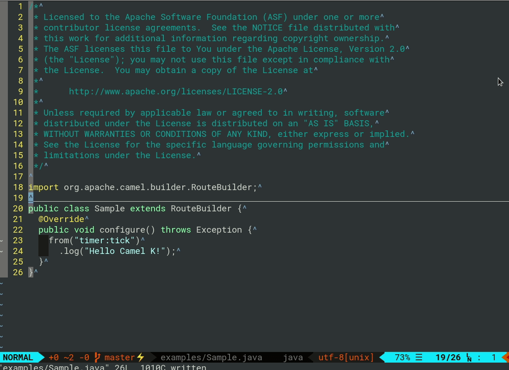
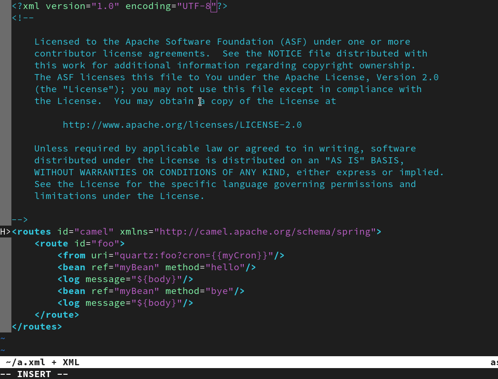

# There are 2 options which are providing the same functionalities.
-  # vim-lsp
-  # coc-vim 
Both of them can be used in Vim, Neovim or Neoclide

# Camel LSP client for Vim

This is short instructions for how to integrate your Vim editor with [Camel LSP server](https://github.com/camel-tooling/camel-language-server).






## Prerequisites

This instruction requires the following plugins:

- [vim-lsp](https://github.com/prabirshrestha/vim-lsp)
- [asyncomplete.vim](https://github.com/prabirshrestha/asyncomplete.vim)

It assumes those plugins below are already installed in `~/.vimrc`:

```vim
Plug 'prabirshrestha/asyncomplete.vim'
Plug 'prabirshrestha/async.vim'
Plug 'prabirshrestha/vim-lsp'
Plug 'prabirshrestha/asyncomplete-lsp.vim'
```

Here we use [vim-plug](https://github.com/junegunn/vim-plug) but you can use a plugin manager of your choice: pathogen.vim, Vundle, NeoBundle, dein.vim, etc.

## Download LSP jar

```sh
mkdir -p ~/lsp/camel-lsp-server
cd ~/lsp/camel-lsp-server
curl -L https://repo1.maven.org/maven2/com/github/camel-tooling/camel-lsp-server/1.5.0/camel-lsp-server-1.5.0.jar -O
```

## Install Camel LSP to your vim

Add following to `~/.vimrc`:

```vim
if executable('java') && filereadable(expand('~/lsp/camel-lsp-server/camel-lsp-server-1.5.0.jar'))
  au User lsp_setup call lsp#register_server({
    \ 'name': 'camel',
    \ 'cmd': {server_info->[
    \   'java',
    \   '-jar',
    \   expand('~/lsp/camel-lsp-server/camel-lsp-server-1.5.0.jar')
    \ ]},
    \ 'whitelist': ['java', 'xml', 'yaml']
    \ })
endif
```


# Camel LS for Vim and Neovim  

This is short instructions for how to integrate Camel LS with Vim editor using coc.nvim (https://github.com/camel-tooling/camel-language-server).

# Text Editing capabilities of Camel XML using coc.nvim


# Text Editing capabilities of Camel URI with Camel JAVA using coc.nvim


## Prerequisites

Add these plugins in your `.vimrc` or `init.vim`
```
Plug 'neoclide/coc.nvim', {'branch': 'release'}
```

# Install Camel LS to Vim and Neovim using Neoclide coc.nvim LSP Client 

### In a `.vimrc` file:
```
" Initialize plugin system
  "
  call plug#begin()
  
  " Shorthand notation; fetches https://github.com/neoclide/coc.nvim
  Plug 'neoclide/coc.nvim', {'branch': 'release'}
  
  call plug#end()
```
### Configuration is required to make coc.nvim easier to work with. This is done as much as possible to avoid conflict with other plugins.

### In a `CocConfig` file:
```
 {
    "languageserver": {
          "camel": {
                "command": "java",
                "args": ["-jar", "/home/npr/Downloads/camel-lsp-server-1.5.0.jar"],
                "filetypes": ["xml", "java", "camel"],
               "trace.server": "verbose"
          }
    }
}
```
Opening the `:CocConfig` file

Evaluating it by calling `:CocList services` to check the running services and also please refer this document to debug further - https://github.com/neoclide/coc.nvim/wiki/Debug-language-server.


